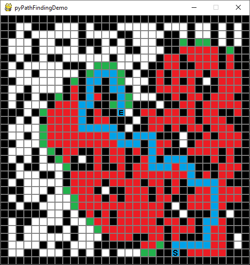

## pyPathFindingDemo

### Abstract
pyPathFindingDemo is a little python program which implements some tree search algorithms to solve a path finding problem visualized with the pygame framework.

### Example

### Description

#### Game board
At the beginning the game board will be generated. 
A pygame window will be created with the given size and will be splittet into 16x16 pixel sized tiles.

There are different kind of tiles:

Texture | Name | Description
--- | --- | ---
 | empty | this fields can be entered
 | wall | this fields can not be entered
 | start | this field is the start for the path
 | end | this field is the destination for the path
 | open | this fields are the front of the search
 | closed | this fields have been passed by the algorithm
 | path | this is the path founded by the algorithm

The border of the game board is restricted with walls.
Inside this borders walls will be generated randomly. 
The ratio between empty fields and walls can be affected by a parameter.

The start field and the end field will be placed at random positions. 

#### Search
The path finding runs in steps. 
The duration of a step can be affected by a parameter.
 
For the path finding a tree search algorithm will be used.
The algorithm has different optimization strategies.
The optimization strategy can be choosen by a parameter.

Optimization strategies:

Name | Description | Result | Time consumption
--- | --- | --- | ---
breadth first | continue the search at the shortest path until now | finds the shortest path | high
depth first | continue the search at the longest path until now | finds a random path | random
greedy | continue the search at the shortest distance (straight line) to the destination | finds mostly a short path | mostly low
A* | continue the search at the lowest sum of the path until now and the distance to the destination (straight line) | finds the shortest path | middle

#### End
If a path was found it will be marked.
The simulation will be stopped so you can study the result.

The window must be closed manually at the end.

### Usage
#### Call
Syntax: `pyPathFindingDemo.py [-h] [--width] [--height] [--walls] [--fps] [--optimization]`

Easiest call of the script with all parameters set to its defaults: `python pyPathFindingDemo.py`

#### Optional Parameters
Name | Description
--- | ---
`-h` | show this help message and exit
`--width` | The width of the game window (minimum=32, default=1920 [Full HD])
`--height` | The width of the game window (minimum=32, default=1080 [Full HD])
`--walls` | Percentage of wall tiles to generate (minimum=0, maximum=1, default=1/3)
`--fps` | The target frames per second to run the simulation (default=25)
`--optimization` | The optimization strategy for the search algorithm [breadth, depth, greedy, a\_star] (default=a\_star)

### Dependencies
Package | Tested version
--- | ---
python | 3.7
pygame | 1.9.6
